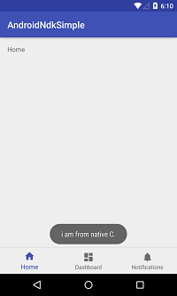

# Android-NDK-Simples

Android NDK的一个简单的例子，使用JNI进行Java和C的交互，带你进入Android底层编程世界

### 使用步骤

1. #### 搭建ndk环境


2. #### 创建jni调用类，定义本地方法

   ```
   public class Java2CJNI {
       
       public native String java2C();
       
   }
   ```


3. #### 通过javah命令获取jni调用类头文件

   > 在项目根目录下，进入main->java目录，全选文件目录栏，直接输入cmd命令并按回车键进入docs命令

   `javah -classpath . -jni -d jni com.example.chengzj.ndk.simple.Java2CJNI`

4. #### 创建实现头文件的.c源文件，并实现头文件的本地方法

   ```
   #include "com_example_chengzj_ndk_simple_Java2CJNI.h"

   JNIEXPORT jstring JNICALL
    Java_com_example_chengzj_ndk_simple_Java2CJNI_java2C
           (JNIEnv *env, jobject jobj){
       return (*env)->NewStringUTF(env,"i am from native C.");
   }
   ```

5. #### 在jni目录下创建Android.mk文件，写入以下内容

   > ​	LOCAL_PATH := $(call my-dir)                                      //固定写法，把路径赋给LOCAL_PATH变量
   >
   > ​	include $(CLEAR_VARS)                                                //清除其他LOCAL变量
   >
   > ​	LOCAL_MODULE    := Java2C                                      //这个模块的名字，最后生成的.so的名字就是它
   >
   > ​	LOCAL_SRC_FILES := Java2C.c 	                                 //这里是要编译的文件
   >
   > ​	include $(BUILD_SHARED_LIBRARY)  	                 //SHARED_LIBRARY就是动态库，即.so文件

6. #### 配置并生成so文件

   在项目的工具类中选择Build->Rebuild Project，进行重新编译工程，然后AS会为我们生成so文件，so文件所在目录为：app\build\intermediates\ndk\debug\lib下

   ```
   ndk {
       moduleName "Java2C" //so文件名
       abiFilters "armeabi", "armeabi-v7a", "x86" //CPU类型
   }
   ```

7. #### 加载so库

   ```
   static {
       System.loadLibrary("Java2C");
   }
   ```

8. #### 执行调用本地方法

   ```
   String result = new Java2CJNI().java2C();
   Toast.makeText(MainActivity.this,result,Toast.LENGTH_LONG).show();
   ```


### 效果图




### 参考

[Android NDK开发之从环境搭建到demo十步流](http://www.apkbus.com/blog-866962-63617.html)

[android studio 编译C生成.so文件](http://www.2cto.com/kf/201607/526887.html)

[在Android Studio中添加libs](http://blog.csdn.net/a34927341/article/details/52932050)


### 推荐

[ImageDownLoader 手写的三级缓存框架二百多行代码搞定图片缓存](https://github.com/cheng2016/AndroidUtil/blob/master/util/ImageDownLoader.java)


### Contact Me

- Github: github.com/cheng2016
- Email: mitnick.cheng@outlook.com
- QQ: 1102743539
- [CSDN: souls0808](https://blog.csdn.net/chengzhenjia?type=blog)

## License

    Copyright 2016 cheng2016,Inc.

    Licensed under the Apache License, Version 2.0 (the "License");
    you may not use this file except in compliance with the License.
    You may obtain a copy of the License at

        http://www.apache.org/licenses/LICENSE-2.0

    Unless required by applicable law or agreed to in writing, software
    distributed under the License is distributed on an "AS IS" BASIS,
    WITHOUT WARRANTIES OR CONDITIONS OF ANY KIND, either express or implied.
    See the License for the specific language governing permissions and
    limitations under the License.
