# Android NDK Simples

现代化的 Android NDK / JNI **图文学习示例**：每个 Demo 都有示意图 +「用途」+「实际场景」，点一下就能跑。

> 原项目（2017）已升级：AGP 8.5 + CMake + AndroidX；17 个可交互知识点，App 列表与本文档同步配图。

## 效果图

### 经典 Hello Native（原版截图）

点 Home 后 Toast 显示 native 返回的字符串：

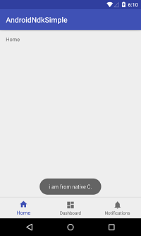

### 现版学习 App

打开 App 后是图文卡片列表：左侧示意图，右侧标题；下方写清 **用途** 与 **实际场景**，点卡片即可在底部看运行结果。

## 环境要求

- Android Studio Hedgehog+
- JDK 17（可用 AS 自带 JBR）
- NDK + CMake（SDK Manager 安装）
- 建议 NDK r25+ / CMake 3.22.1

## 快速开始

1. Android Studio 打开本仓库根目录  
2. Gradle Sync（首次会拉依赖 / NDK）  
3. Run `app`  
4. 点任意卡片，看底部「运行结果」

```bash
./gradlew :app:assembleDebug
```

---

## 17 个示例（图文）

### 1. Hello from Native


| | |
|--|--|
| **干什么** | 从 C++ `NewStringUTF` 返回一句 Hello，验证 so 已加载 |
| **用途** | 打通 `loadLibrary` → JNI 的最小闭环，所有 NDK 项目第一步 |
| **实际场景** | 启动探针、native 版本号、确认打包的 `.so` 是否装上 |
| **API** | `System.loadLibrary` / `NewStringUTF` |

### 2. 基本类型加法

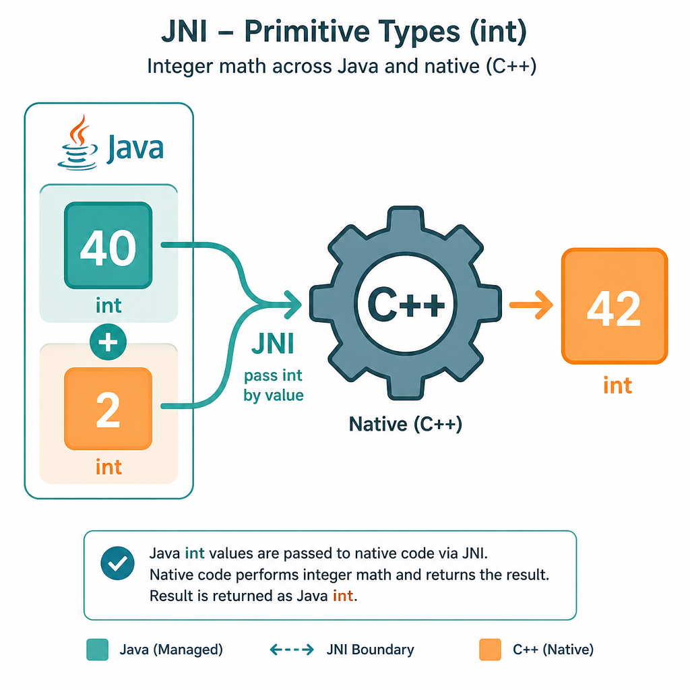

| | |
|--|--|
| **干什么** | Java `int` 传进 native 做加法再返回 |
| **用途** | 搞清 `int ↔ jint` 等基本类型映射，无对象开销 |
| **实际场景** | 传感器换算、协议字段解析、简单打分/校验和 |
| **API** | `jint` 参数与返回值 |

### 3. 字符串往返

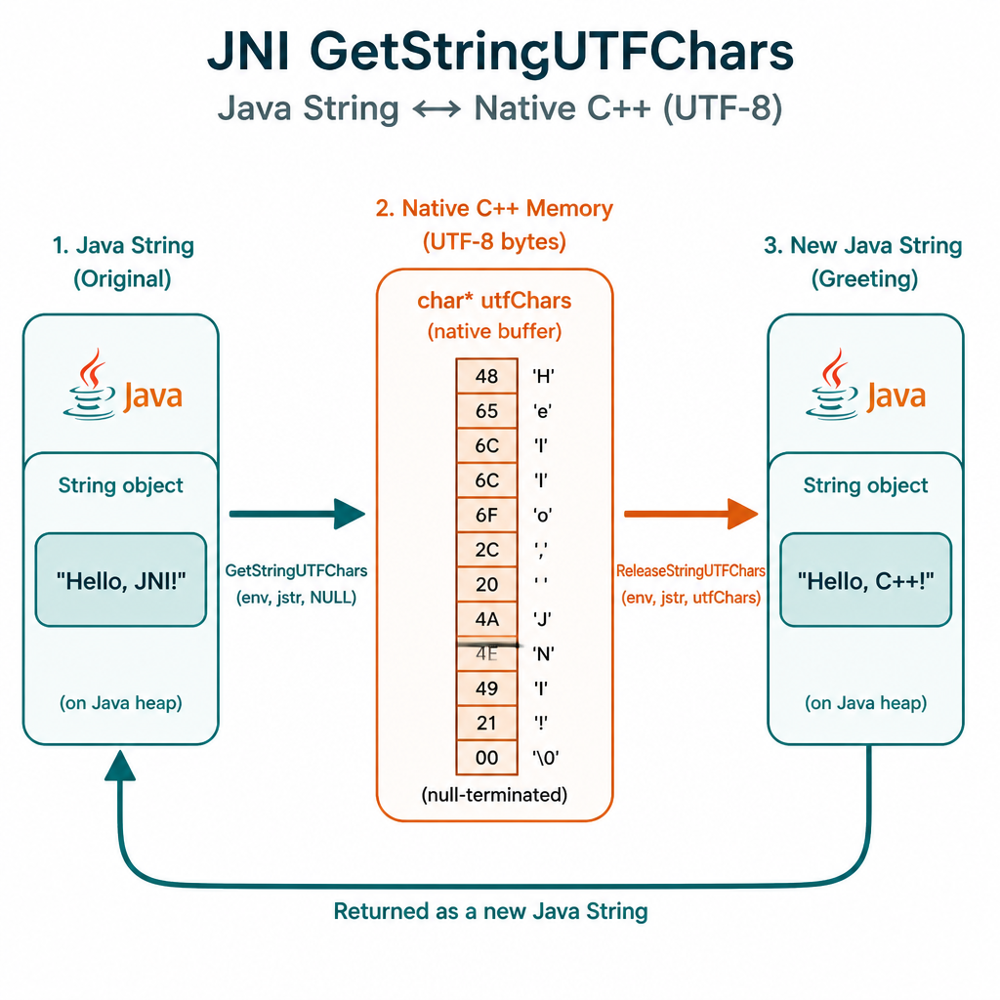

| | |
|--|--|
| **干什么** | Java String → C++ 修改/拼接 → 新 String |
| **用途** | 学会 `GetStringUTFChars` / `Release` / `NewStringUTF`，防泄漏与乱码 |
| **实际场景** | 路径拼接、日志格式化、把 native 错误信息带回 UI |
| **API** | `GetStringUTFChars` / `NewStringUTF` |

### 4. int[] 求和

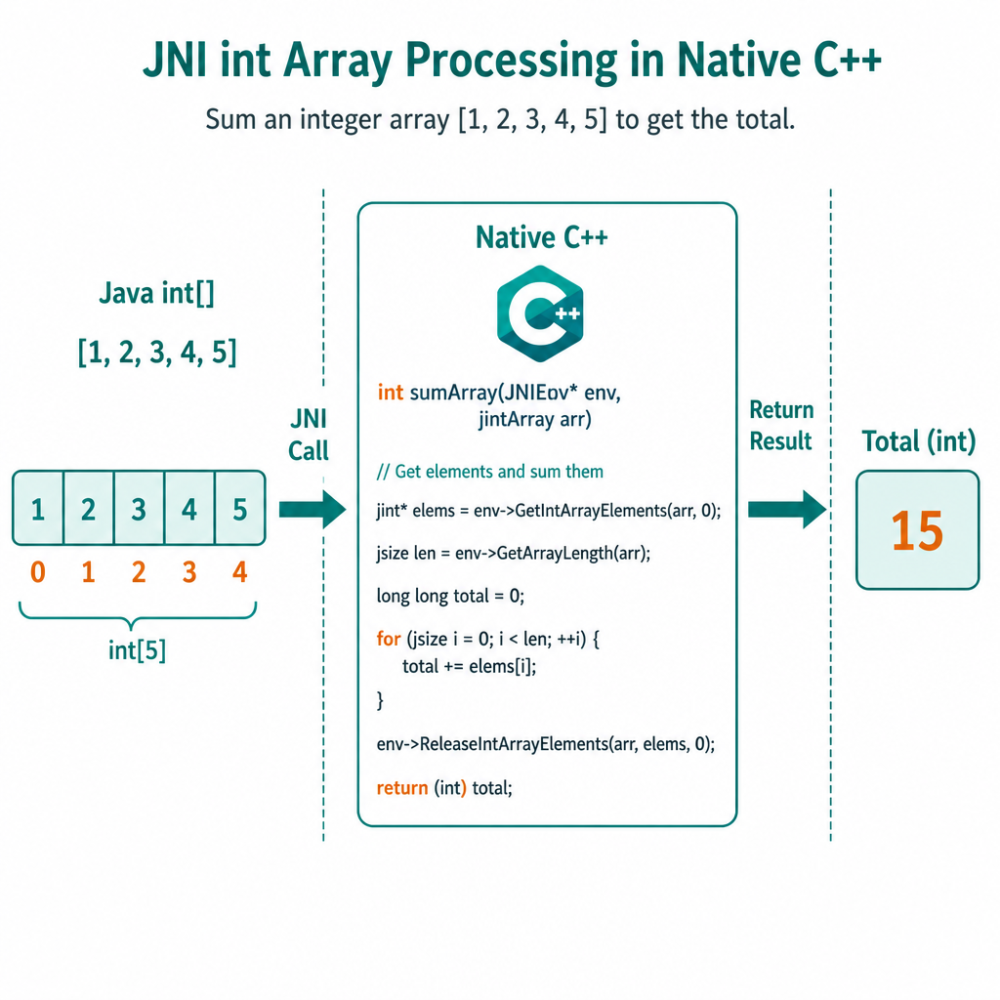

| | |
|--|--|
| **干什么** | 一次把整段 `int[]` 交给 native 求和 |
| **用途** | 掌握数组临界区：`GetIntArrayElements` + `JNI_ABORT` |
| **实际场景** | 音频采样统计、特征聚合、批量评分（比逐元素 JNI 快） |
| **API** | `GetIntArrayElements` |

### 5. 原地反转 byte[]

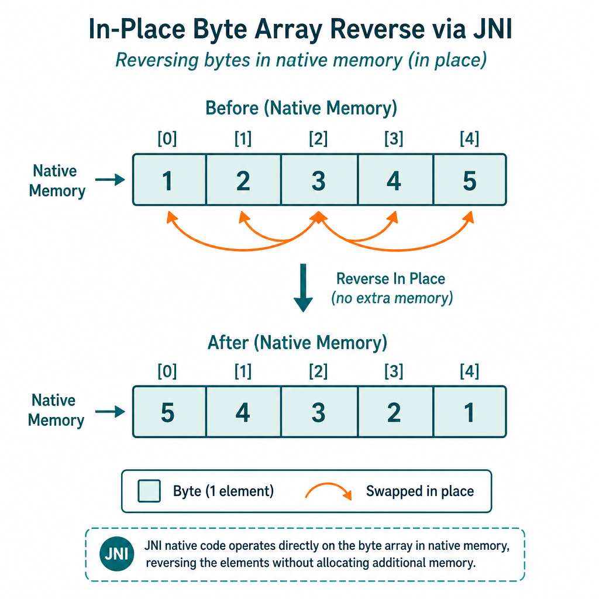

| | |
|--|--|
| **干什么** | 不新建数组，直接把同一块 `byte[]` 反转写回 |
| **用途** | 理解 `ReleaseByteArrayElements(mode=0)` 如何提交修改 |
| **实际场景** | 字节序翻转、简易加扰、对网络包/文件块 in-place 处理 |
| **API** | `Get/ReleaseByteArrayElements` |

### 6. XOR 加密 byte[]

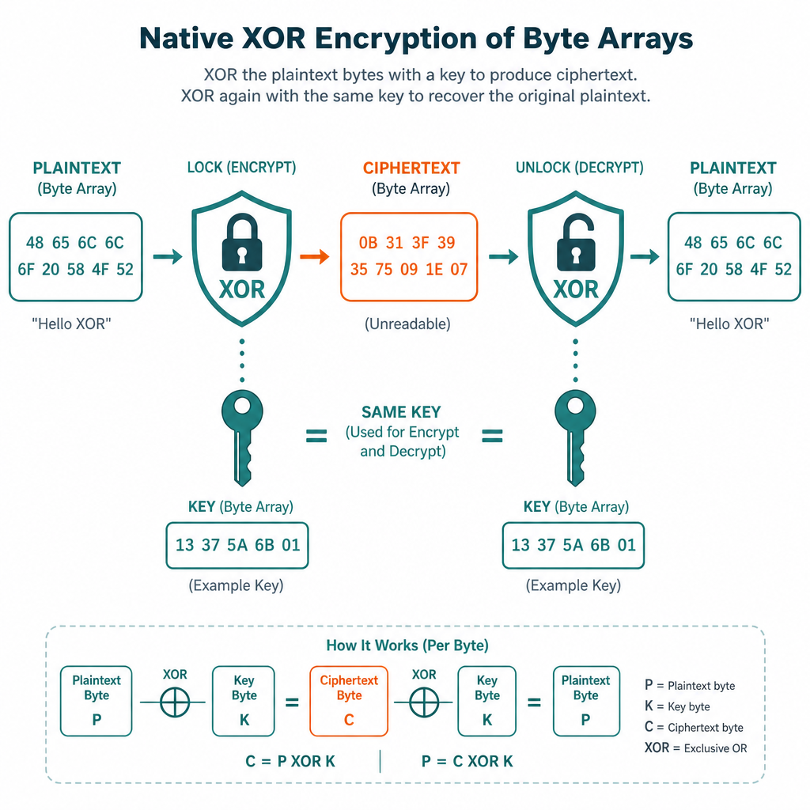

| | |
|--|--|
| **干什么** | Native 分配新数组，对字节做异或后返回 |
| **用途** | 学会 `NewByteArray` / `SetByteArrayRegion` |
| **实际场景** | 轻量混淆、固件包异或预处理（**示例不是安全加密**） |
| **API** | `NewByteArray` / `SetByteArrayRegion` |

### 7. 读取 Java 对象字段

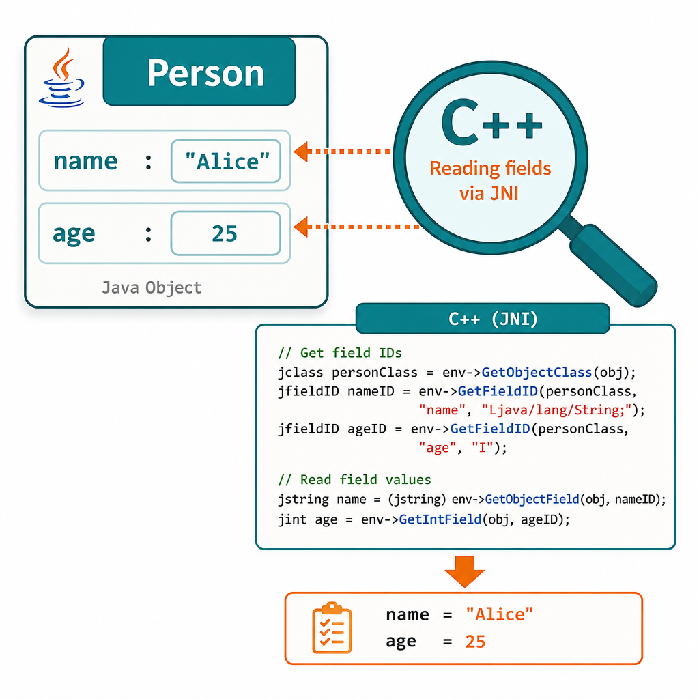

| | |
|--|--|
| **干什么** | C++ 用 `GetFieldID` 读 `Person.name` / `age` |
| **用途** | 让 native 直接读 Java 对象，不必拆成一堆基本参数 |
| **实际场景** | 配置/用户模型交给 native 渲染、物理或业务规则引擎 |
| **API** | `GetFieldID` / `GetObjectField` / `GetIntField` |

### 8. Native 创建 Java 对象

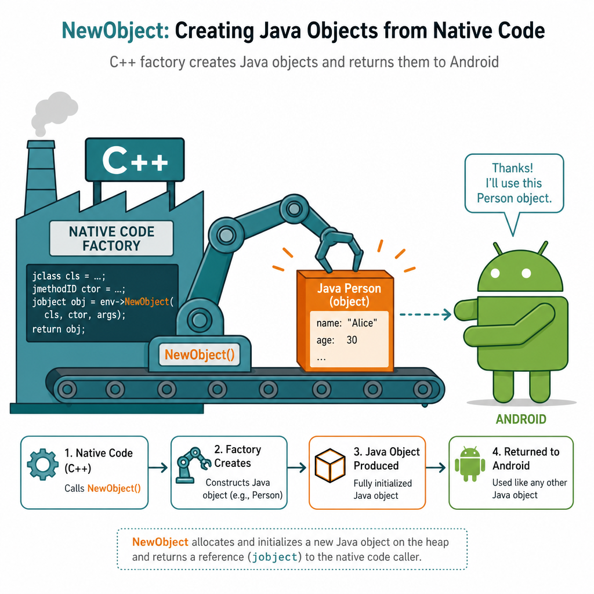

| | |
|--|--|
| **干什么** | C++ `NewObject` 造出 `Person` 交还 Java |
| **用途** | 缓存 `jclass` + 构造方法，从 native 返回结构化结果 |
| **实际场景** | 协议解析后直接吐 Bean、推理结果封装、减少多次 JNI 往返 |
| **API** | `NewObject` + `JNI_OnLoad` GlobalRef 缓存 |

### 9. C++ 回调 Java 接口

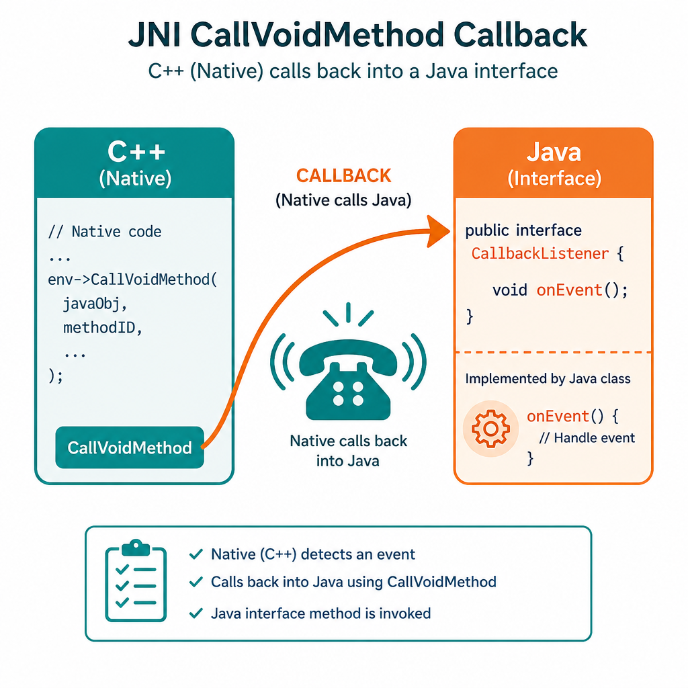

| | |
|--|--|
| **干什么** | Native 算完后 `CallVoidMethod` 调 `NativeCallback` |
| **用途** | 事件驱动：native 主动通知，而不是 Java 轮询 |
| **实际场景** | 下载进度、解码完成、播放器/传感器状态推到 UI |
| **API** | `CallVoidMethod` |

### 10. Native 抛出异常

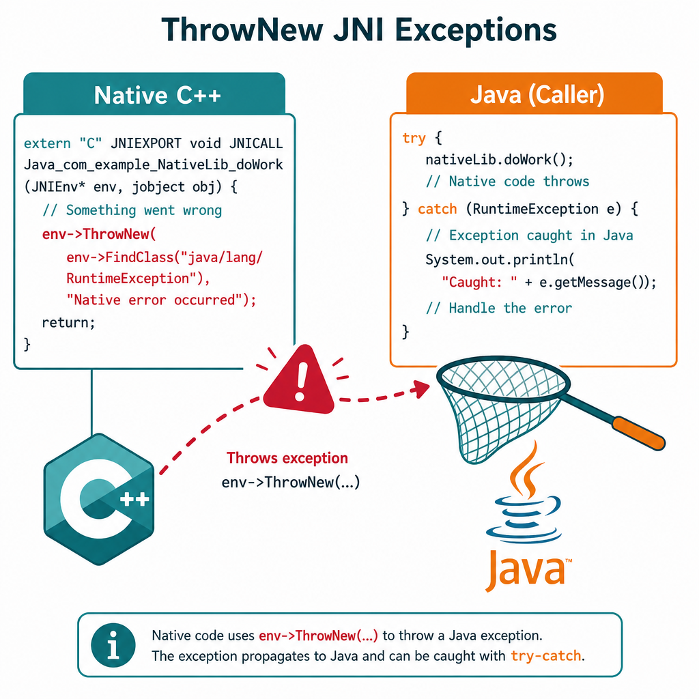

| | |
|--|--|
| **干什么** | `ThrowNew` 抛出，Java `catch` 接住 |
| **用途** | 把 native 错误变成熟悉的 Java 异常模型 |
| **实际场景** | 参数非法、文件失败、解码错误——统一错误处理 |
| **API** | `ThrowNew` |

### 11. 静态 native 方法

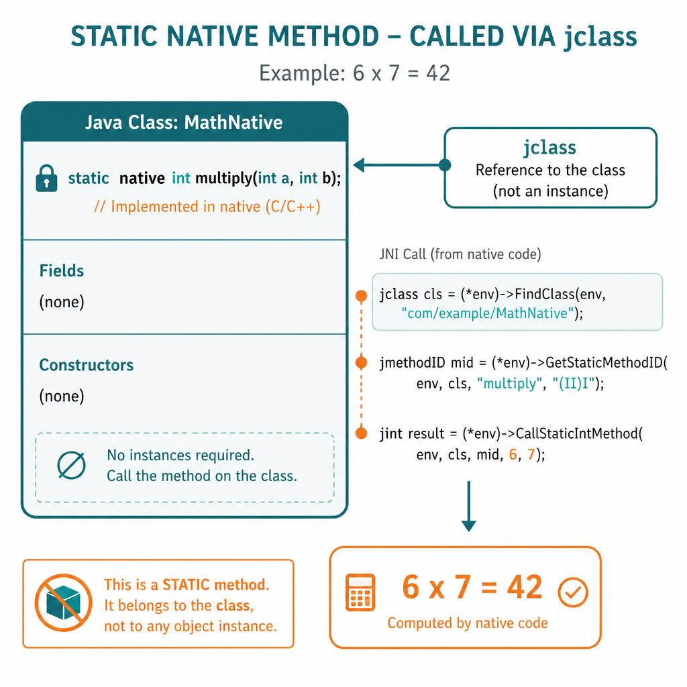

| | |
|--|--|
| **干什么** | 不需要实例；C 侧第二个参数是 `jclass` |
| **用途** | 分清实例 / 静态 native，工具函数不必 `new` |
| **实际场景** | 无状态数学库、编解码入口、纯函数工具 |
| **API** | `static native` / `jclass` |

### 12. ABI / 编译信息


| | |
|--|--|
| **干什么** | 读指针宽度、`__ANDROID_API__`、CPU 架构 |
| **用途** | 运行时确认当前 so 的 ABI，排查装错架构 |
| **实际场景** | 崩溃上报附带 ABI、按架构切路径、兼容性诊断 |
| **API** | 架构宏 / `__ANDROID_API__` |

### 13. 字符串 UTF 探测

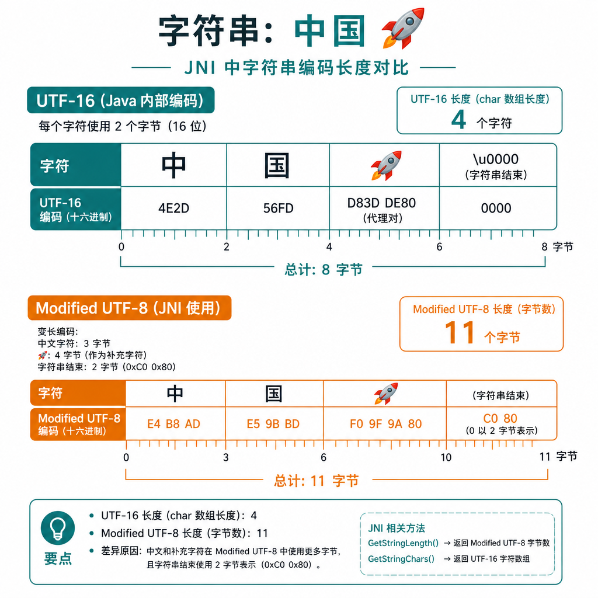

| | |
|--|--|
| **干什么** | 对比 UTF-16 码元长度 vs Modified UTF-8 字节长度 |
| **用途** | 避开中文 / emoji 在 JNI 里的长度坑 |
| **实际场景** | 按字节截断协议、缓冲区预分配、国际化文案进 native |
| **API** | `GetStringLength` / `GetStringUTFLength` |

### 14. Java vs Native 循环

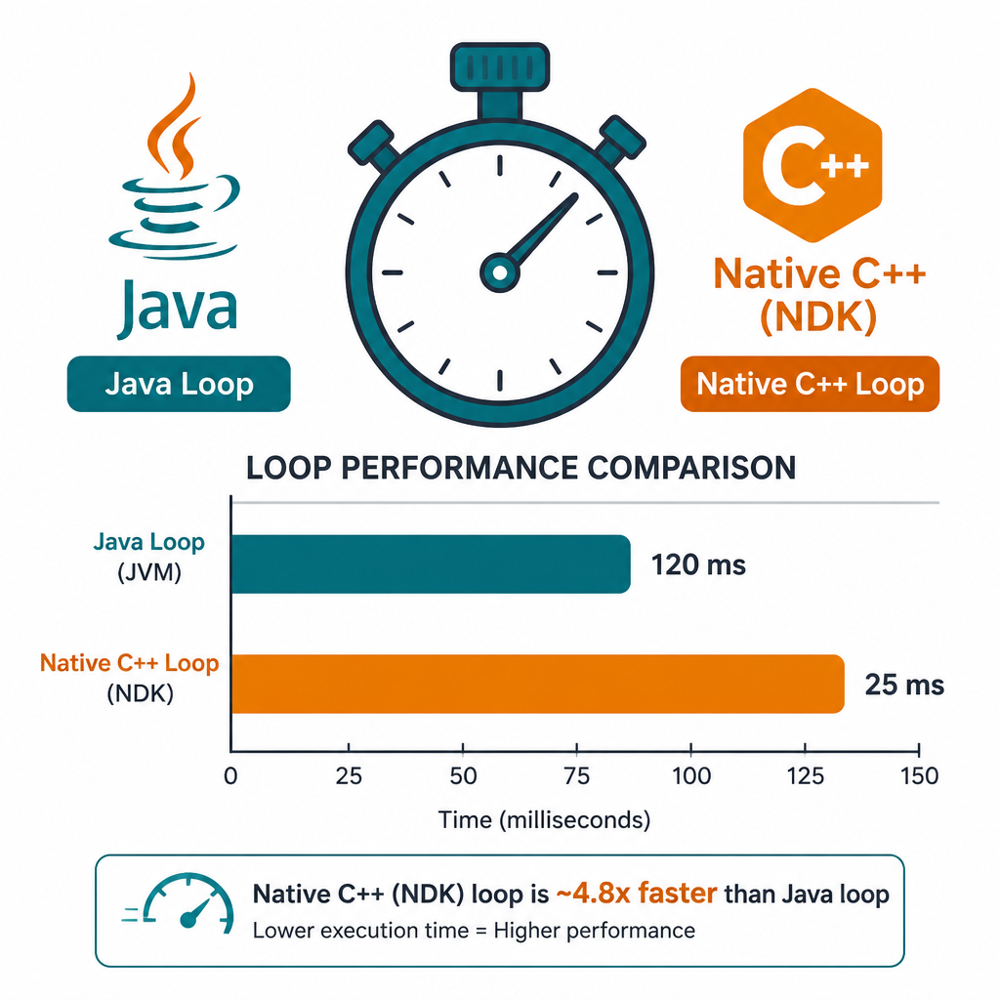

| | |
|--|--|
| **干什么** | 同算法两边粗略计时 |
| **用途** | 用数据判断：热循环可能 native 更快，但 JNI 边界也有成本 |
| **实际场景** | 决定滤波 / DSP / 压缩是否值得下沉；避免为了 NDK 而 NDK |
| **API** | 计时对比 `nativeChecksum` |

### 15. Native 线程回调


| | |
|--|--|
| **干什么** | `pthread` 里 `AttachCurrentThread` 再回调 Java |
| **用途** | 跨线程 JNI 三件套：GlobalRef + Attach + Detach |
| **实际场景** | 解码/采集/长任务线程完成后再通知主线程刷 UI |
| **API** | `pthread` / `AttachCurrentThread` |

### 16. DirectByteBuffer


| | |
|--|--|
| **干什么** | C++ 通过地址直接读 DirectBuffer（堆缓冲会返回 -1） |
| **用途** | 零拷贝共享内存，减少 Java↔Native 搬运 |
| **实际场景** | Camera / MediaCodec、OpenGL 上传、音视频流水线 |
| **API** | `GetDirectBufferAddress` |

### 17. RegisterNatives

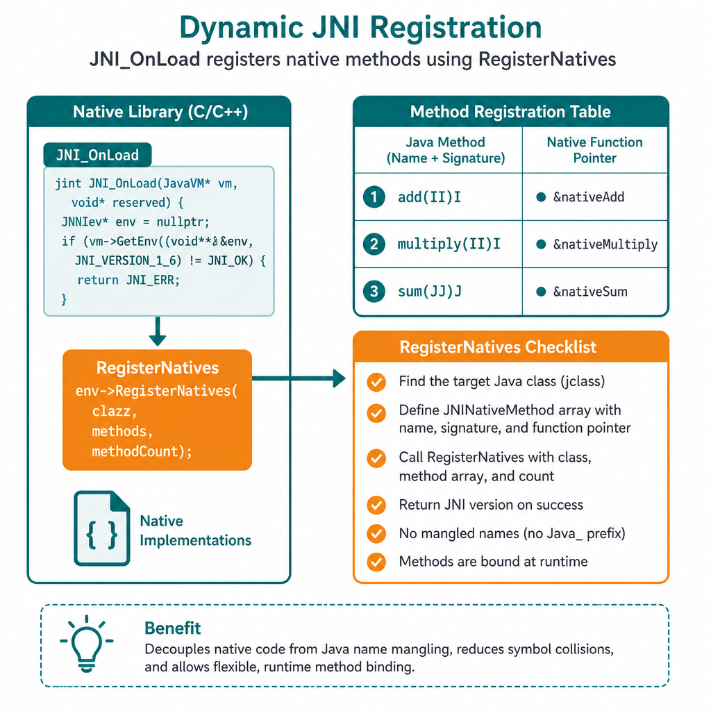

| | |
|--|--|
| **干什么** | `JNI_OnLoad` 动态注册，无需 `Java_包名_类_方法` 符号 |
| **用途** | 控制导出符号，便于混淆与多库共存 |
| **实际场景** | 商业 SDK 隐藏符号、插件式 native、加载时统一绑定 |
| **API** | `JNI_OnLoad` + `RegisterNatives` |

---

## 工程结构

```
app/src/main/
├── cpp/                         # CMake → libndk_demo.so
│   ├── native_bridge.cpp
│   └── jni_helpers.*
├── java/.../ndk/simple/         # Demo 列表 + NativeBridge
├── res/drawable-nodpi/demo_*.png
└── res/layout/item_demo.xml     # 图文卡片
screenshort/
├── device-2017-05-31-021110.png # 经典效果图
└── demos/demo_XX_*.png          # 每个示例的示意图
```

## 相对旧版

| 旧 (2017) | 新 (2.0) |
|-----------|----------|
| 单一 `java2C()` + Toast | 17 个图文 Demo |
| AGP 2.3 / Android.mk | AGP 8.5 / CMake |
| Support Library | AndroidX |
| 只有一张效果图 | 效果图 + 每例示意图 |

## License

Apache License 2.0 — Copyright 2016 cheng2016.
